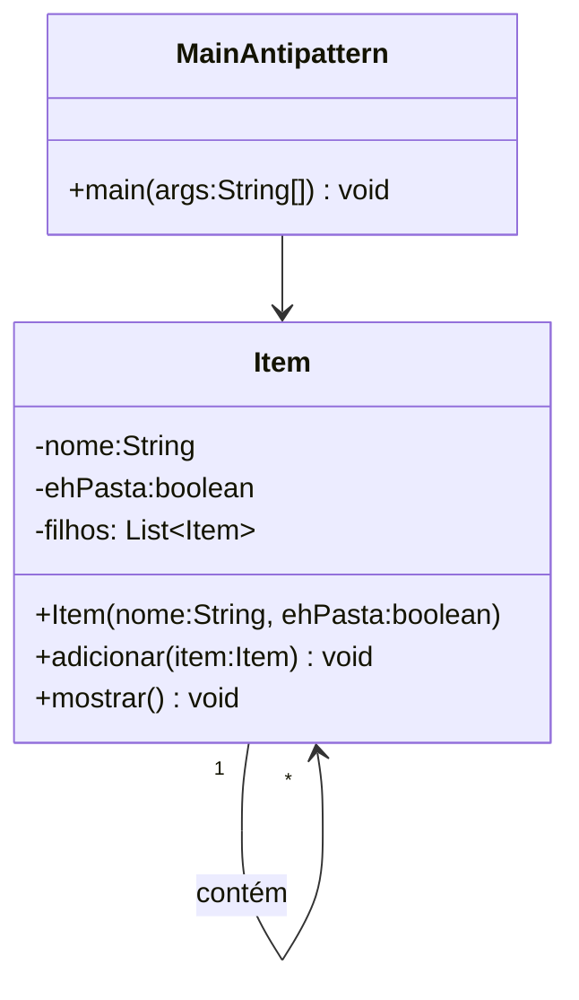

```mermaid
  classDiagram
    direction TB

    class Item {
        -nome:String
        -ehPasta:boolean
        -filhos: List~Item~
        +Item(nome:String, ehPasta:boolean)
        +adicionar(item:Item) void
        +mostrar() void
    }

    class MainAntipattern {
        +main(args:String[]) void
    }

    Item "1" --> "*" Item : contém
    MainAntipattern --> Item

```
