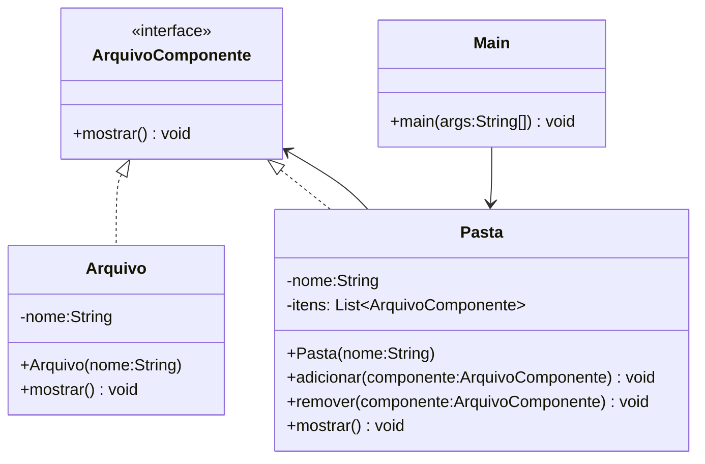

```mermaid
  classDiagram
    direction TB

    class ArquivoComponente {
        <<interface>>
        +mostrar() void
    }

    class Arquivo {
        -nome:String
        +Arquivo(nome:String)
        +mostrar() void
    }

    class Pasta {
        -nome:String
        -itens: List~ArquivoComponente~
        +Pasta(nome:String)
        +adicionar(componente:ArquivoComponente) void
        +remover(componente:ArquivoComponente) void
        +mostrar() void
    }

    class Main {
        +main(args:String[]) void
    }

    ArquivoComponente <|.. Arquivo
    ArquivoComponente <|.. Pasta
    Pasta --> ArquivoComponente
    Main --> Pasta

```
