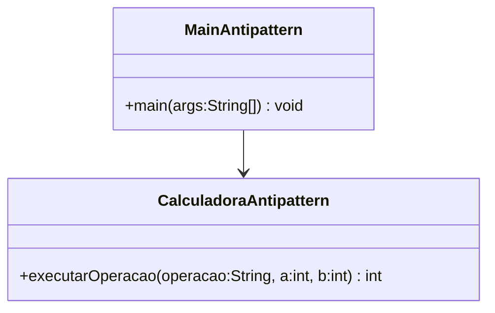

```mermaid

classDiagram
    direction TB

    class CalculadoraAntipattern {
        +executarOperacao(operacao:String, a:int, b:int) int
    }

    class MainAntipattern {
        +main(args:String[]) void
    }

    MainAntipattern --> CalculadoraAntipattern
```
