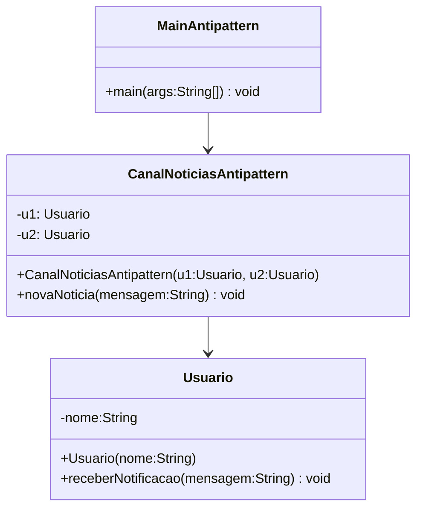

```mermaid
  classDiagram
      direction TB
  
      class Usuario {
          -nome:String
          +Usuario(nome:String)
          +receberNotificacao(mensagem:String) void
      }
  
      class CanalNoticiasAntipattern {
          -u1: Usuario
          -u2: Usuario
          +CanalNoticiasAntipattern(u1:Usuario, u2:Usuario)
          +novaNoticia(mensagem:String) void
      }
  
      class MainAntipattern {
          +main(args:String[]) void
      }
  
      CanalNoticiasAntipattern --> Usuario
      MainAntipattern --> CanalNoticiasAntipattern

```
