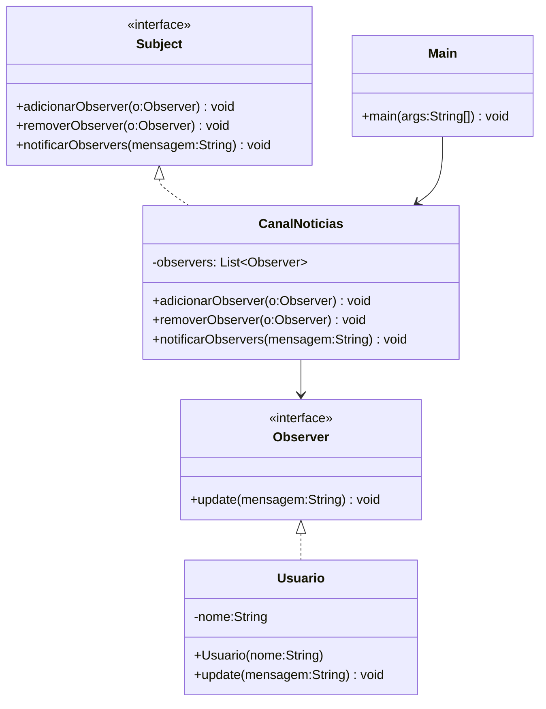

```mermaid
  classDiagram
    direction TB

    class Observer {
        <<interface>>
        +update(mensagem:String) void
    }

    class Usuario {
        -nome:String
        +Usuario(nome:String)
        +update(mensagem:String) void
    }

    class Subject {
        <<interface>>
        +adicionarObserver(o:Observer) void
        +removerObserver(o:Observer) void
        +notificarObservers(mensagem:String) void
    }

    class CanalNoticias {
        -observers: List~Observer~
        +adicionarObserver(o:Observer) void
        +removerObserver(o:Observer) void
        +notificarObservers(mensagem:String) void
    }

    class Main {
        +main(args:String[]) void
    }

    Observer <|.. Usuario
    Subject <|.. CanalNoticias
    CanalNoticias --> Observer
    Main --> CanalNoticias

```
